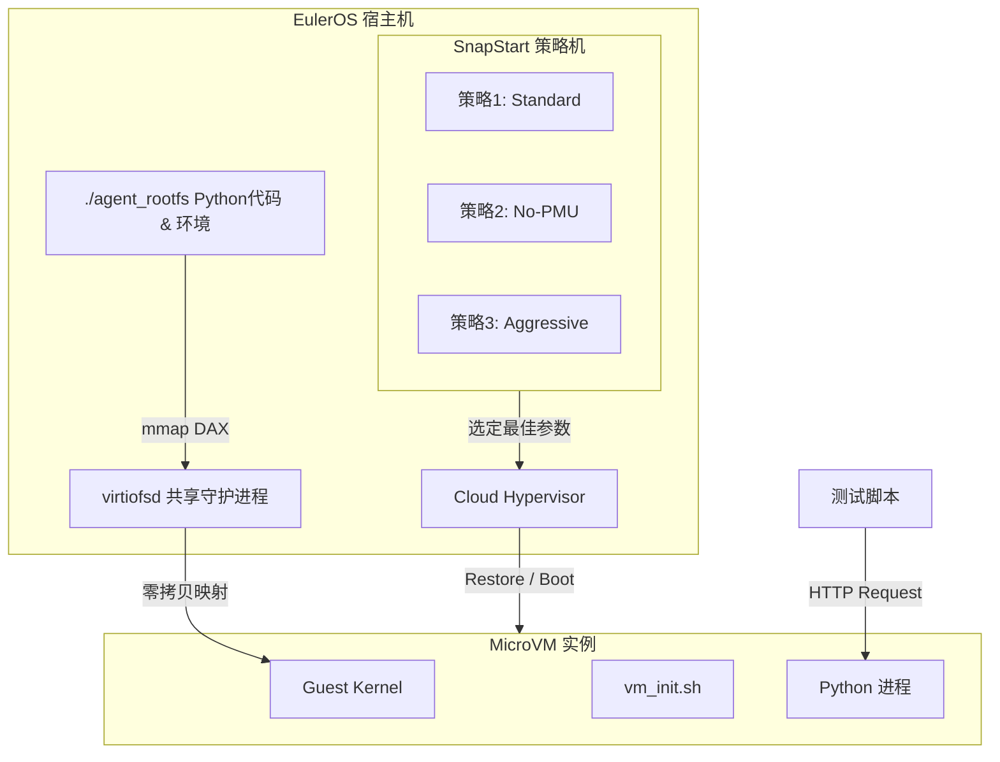

# Cloud Hypervisor Agent Runtime POC (SnapStart Edition)

## 1. 项目简介

本 POC 验证了一种基于 Cloud Hypervisor (CH) 的高密度、瞬时启动 Agent Runtime 架构。
它实现了 **"Scale-to-Zero"** 能力：Agent 代码以文件形式存在于 Host，请求到来时通过 **Virtio-fs** 和 **Host Page Cache** 实现毫秒级冷启动。同时包含 **SnapStart** 机制，尝试通过快照复用已初始化的 Python 进程。

## 2. 架构原理

核心理念是 **"VM as a Container"**：不使用 VM 内部的 Docker，而是利用 Host 文件系统作为容器层。


## 3. 运行前准备 
   由于此版本不进行网络下载，请确保当前目录下包含以下文件： 
	 * **vmlinux**: 适用于当前架构的未压缩 Linux 内核。 
     * **rootfs.ext4**: 包含 Python 环境的根文件系统镜像。 
## 4. 运行方式 
```bash # 赋予权限 chmod +x full_poc_local.py 
# 运行 (需要 root 权限) 
sudo ./full_poc_local.py
```
## 5. 关于 Snapshot (SnapStart) 的技术讨论

在 ARM64 架构（特别是 EulerOS/CentOS 4.19+ 内核）上，KVM 对寄存器状态的保存可能存在兼容性问题（常见错误 `os error 22`）。本 POC 实现了三种渐进式策略来尝试解决此问题：

1.  **Standard (标准模式)**
    *   **参数**: `boot=1`
    *   **描述**: 尝试保存所有 CPU 状态。在较新内核 (5.15+) 上表现最佳。
2.  **No-PMU (禁用 PMU)**
    *   **参数**: `boot=1,pmu=off`
    *   **描述**: 显式禁用性能监控单元寄存器的保存。解决了 90% 的 EulerOS 兼容性问题。
3.  **Aggressive (禁用 SVE/PMU)**
    *   **参数**: `boot=1,pmu=off,sve=off`
    *   **描述**: 进一步屏蔽 SVE 矢量扩展。这是针对特定硬件的保底方案。

**降级机制 (Fallback)**:
如果上述所有策略均失败，Runtime 将自动切换到 **Direct Boot (直接启动)** 模式。得益于 Virtio-fs 的 Lazy Loading，Direct Boot 依然能提供 < 300ms 的冷启动速度。

## 6. 运行要求

*   **OS**: Linux ARM64 (EulerOS)
*   **Dependencies**: `python3`, `cloud-hypervisor`, `virtiofsd` (或 `qemu-virtiofsd`)
*   **Privilege**: Root 权限 (用于 mount 和网络配置)

```bash
sudo python3 full_poc_local.py
```
